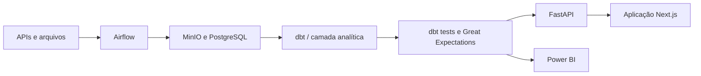

# Football Analytics

[**Acessar a aplicação**](https://football.victorhob.me/) · [Power BI](https://football.victorhob.me/analises) · [Documentação](docs/GUIA_MESTRE_APLICACAO.md)

[](https://github.com/victorhobdev/football-analytics/actions/workflows/ci.yml)


Integra dados históricos de futebol provenientes de APIs e arquivos, organiza-os em uma camada analítica e os disponibiliza em uma aplicação web e no Power BI. O acervo publicado reúne **62 competições**, **861 temporadas**, **248,9 mil partidas** e **32,5 mil jogadores**.


## Plataforma

### Análises no Power BI

Rankings, comparações, desempenho e cobertura do acervo em um relatório público incorporado à aplicação.


### Explore a plataforma

O catálogo em cards resume a cobertura das principais competições e conduz às temporadas disponíveis.


O arquivo da Copa do Mundo percorre 22 edições, com campeão, país-sede, seleções e partidas por edição.


O catálogo completo reúne competições, regiões, tipos, temporadas e última edição publicada.


O mercado permite filtrar transferências por jogador, clube, tipo, direção e valor.


## Engenharia de dados



O Airflow ingere APIs e arquivos em armazenamento de objetos e PostgreSQL; o dbt transforma esses dados em modelos analíticos, validados antes do consumo. A FastAPI serve a aplicação web, enquanto snapshots da camada `mart` alimentam o Power BI. A ingestão implementa escopos incrementais e de backfill, upserts idempotentes, retries e registro de execução; as DAGs atuais são acionadas manualmente.

- **Ingestão e orquestração:** Airflow, provedores configuráveis, incrementalidade, retry e reprocessamento.
- **Dados e qualidade:** MinIO, PostgreSQL, dbt, testes SQL e Great Expectations.
- **Consumo:** FastAPI, aplicação Next.js e Power BI versionado em PBIP/PBIR.

## Qualidade e operação

| Evidência versionada | Estado atual |
| --- | ---: |
| Testes Python coletados | 93 |
| Modelos dbt | 104 |
| Testes SQL singulares dbt | 50 |
| Expectativas Great Expectations | 76 |
| Acervo publicado | 62 competições · 861 temporadas |
| Volume publicado | 248,9 mil partidas · 32,5 mil jogadores |

A CI automatiza testes Python, parse do dbt, validação do Compose, typecheck/build do frontend e validação estrutural do Power BI. A aplicação é publicada em uma VM OCI com containers e proxy HTTPS; atualização de dados, DAGs e refresh/publicação do Power BI permanecem operações manuais. O ambiente local depende de `.env` e dos snapshots privados de serving/deltas descritos no script de inicialização.

## Execução local

Pré-requisitos: Docker Desktop, PowerShell e os artefatos privados esperados em `artifacts/`.

```powershell
Copy-Item .env.example .env
# Preencha .env sem versionar credenciais.
.\start-local.ps1
```

A aplicação fica em `http://localhost:3001`. Valide a configuração antes de iniciar:

```powershell
docker compose --env-file .env.example config --quiet
```

Consulte o [guia de deploy e execução](deploy/oci/README.md) para dependências e operação detalhadas.

## Documentação complementar

- [Visão geral da aplicação e arquitetura](docs/GUIA_MESTRE_APLICACAO.md)
- [Power BI e fluxo analítico](docs/bi/README.md)
- [Contrato do modelo analítico](docs/bi/MODELO_PUBLICO.md)
- [Qualidade e limitações conhecidas](docs/bi/QUALIDADE_E_LIMITACOES.md)
- [Refresh manual do Power BI](docs/bi/REFRESH_MANUAL.md)
- [Deploy em OCI](deploy/oci/README.md)
- [Gates de testes e CI](.github/workflows/ci.yml)
