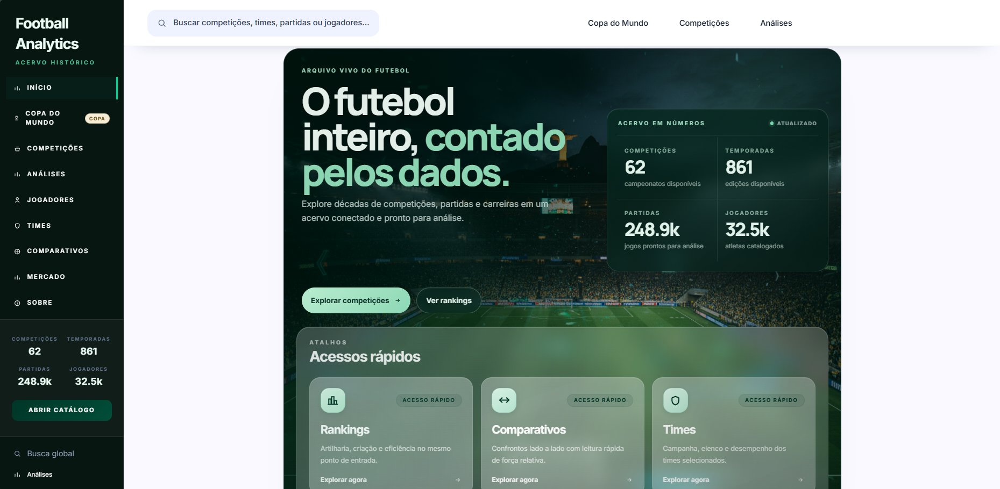
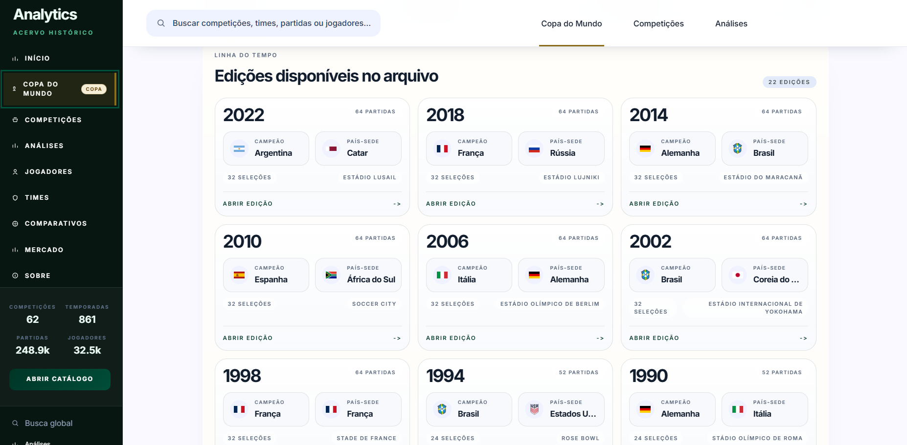
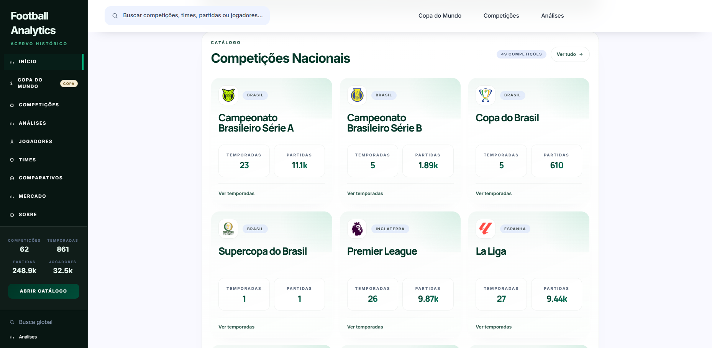
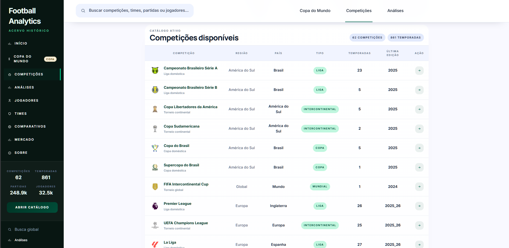
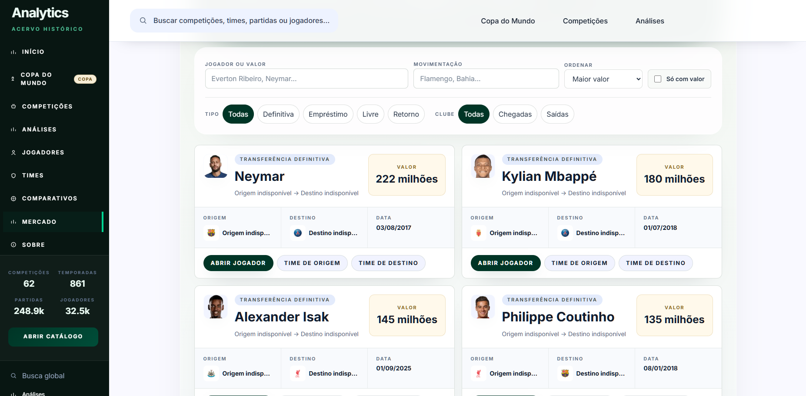
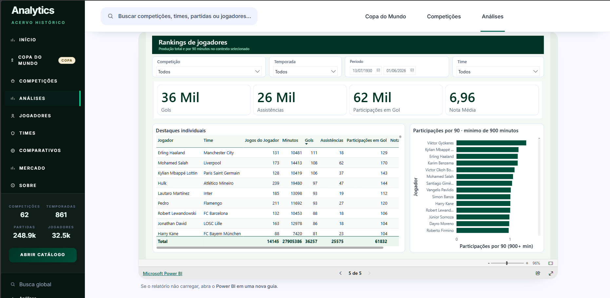
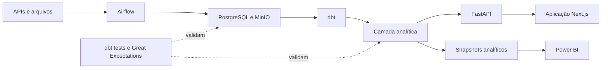

# Football Analytics

## Apresentação

Plataforma de dados que consolida décadas de futebol em um acervo navegável de competições, temporadas, partidas, jogadores, transferências e análises.

[**Acessar a aplicação**](https://football.victorhob.me/) · [Power BI](https://football.victorhob.me/analises)  · [](https://github.com/victorhobdev/football-analytics/actions/workflows/ci.yml)

| Competições | Temporadas | Partidas | Jogadores |
| ---: | ---: | ---: | ---: |
| **62** | **861** | **248,9 mil** | **32,5 mil** |



## Explore o acervo

Navegue por competições e temporadas, consulte jogadores e times, compare desempenhos e explore transferências. O arquivo da Copa do Mundo reúne 22 edições, de 1930 a 2022.



<details>
<summary>Ver mais telas da aplicação</summary>

**Competições em destaque**



**Catálogo completo**



**Mercado de transferências**



</details>

## Análises no Power BI

O relatório público reúne rankings, desempenho e comparações, com filtros por competição, temporada, período e time.



## Do dado ao produto



O Airflow ingere APIs e arquivos; PostgreSQL e MinIO preservam os dados até a modelagem analítica com dbt. A mesma camada curada abastece a FastAPI e os snapshots do Power BI, com validações antes do consumo.

**Stack:** Python, Airflow, PostgreSQL, MinIO, dbt, Great Expectations, FastAPI, Next.js, React, TypeScript, Power BI, Docker e GitHub Actions.

- Ingestão incremental ou por backfill, com retries e registro de execução.
- Upserts para reexecução idempotente no PostgreSQL.
- Modelagem dimensional e marts com dbt.
- Testes dbt e Great Expectations sobre dados brutos e analíticos.

A CI executa testes Python, parse do dbt, validação do Compose, typecheck/build do frontend e verificações estruturais do Power BI. A aplicação publicada roda em containers em uma VM OCI; DAGs, atualização do acervo e refresh/publicação do Power BI são acionados manualmente.

## Executar localmente

Requer Docker Desktop e PowerShell. Copie a configuração, preencha as variáveis locais e inicie:

```powershell
Copy-Item .env.example .env
.\start-local.ps1
```

Aplicação: `http://localhost:3001`

Validação da configuração:

```powershell
docker compose --env-file .env.example config --quiet
```

O ambiente completo também usa artefatos de dados não versionados. Consulte o [guia de execução e deploy](deploy/oci/README.md) e o [script de inicialização](tools/start-local.ps1).

## Documentação

- **Visão geral e arquitetura:** [guia da aplicação](docs/GUIA_MESTRE_APLICACAO.md)
- **Modelo analítico e Power BI:** [modelo público](docs/bi/MODELO_PUBLICO.md) · [Power BI](docs/bi/README.md)
- **Qualidade e limitações:** [qualidade do BI](docs/bi/QUALIDADE_E_LIMITACOES.md)
- **Execução e deploy:** [refresh do Power BI](docs/bi/REFRESH_MANUAL.md) · [deploy em OCI](deploy/oci/README.md)
