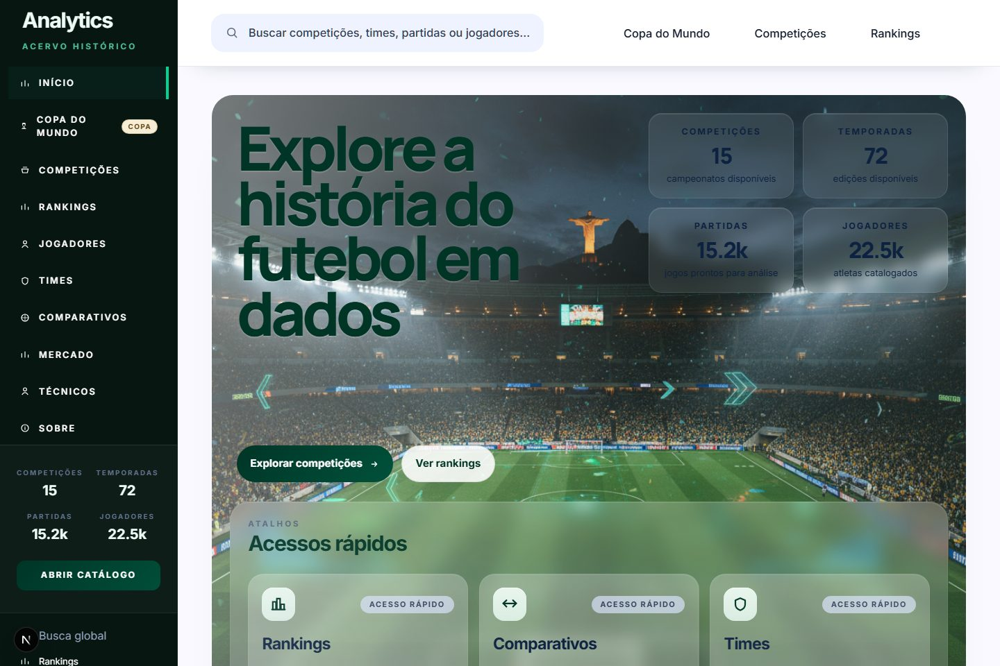
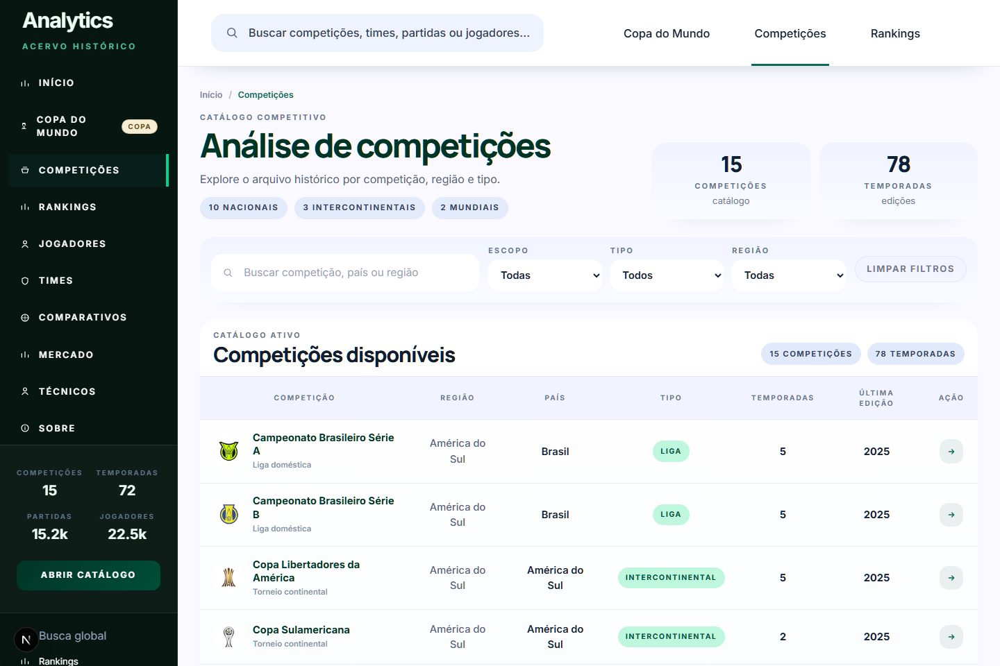
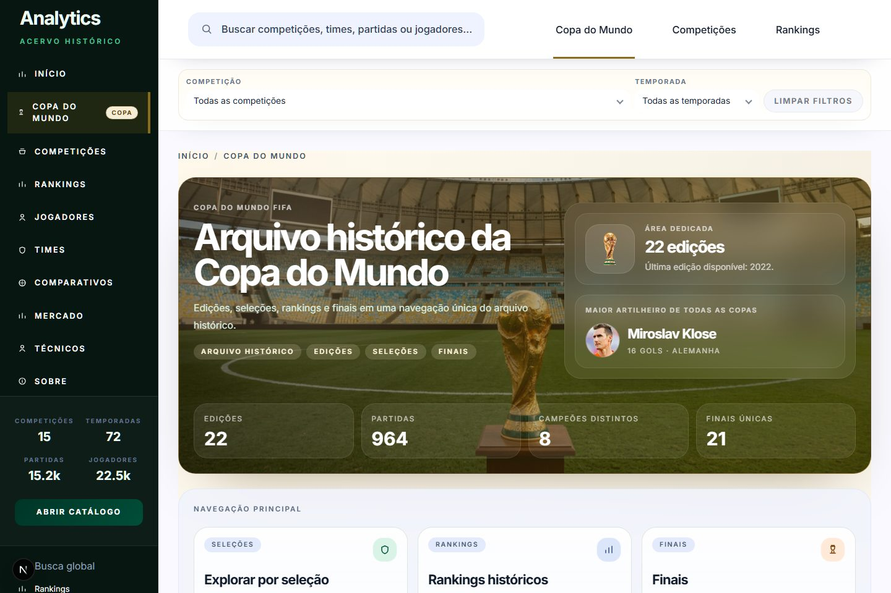
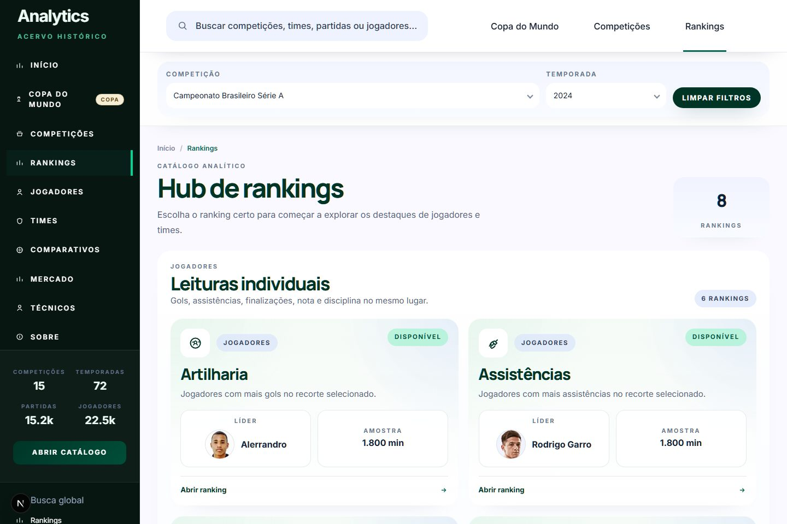
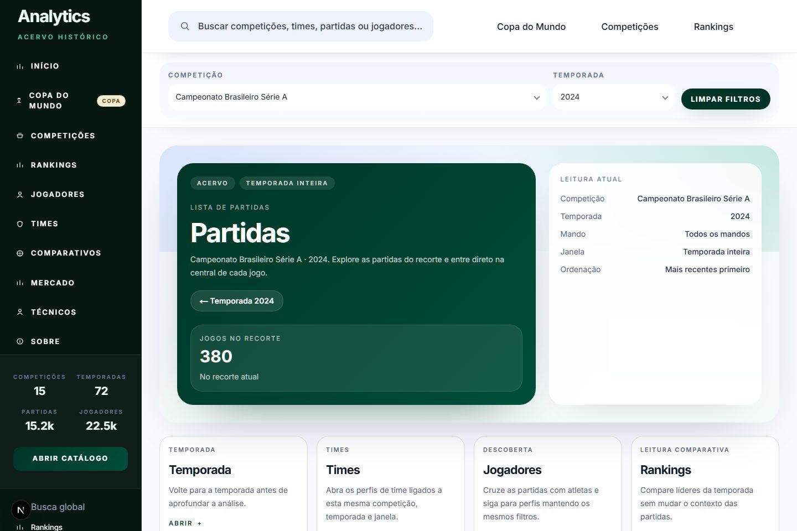
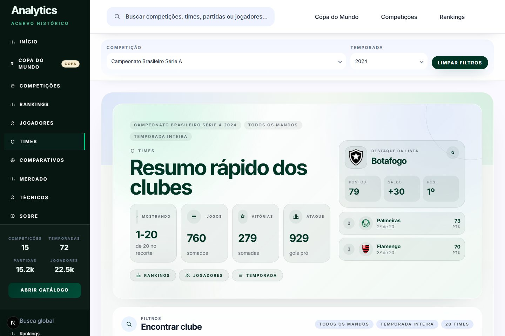
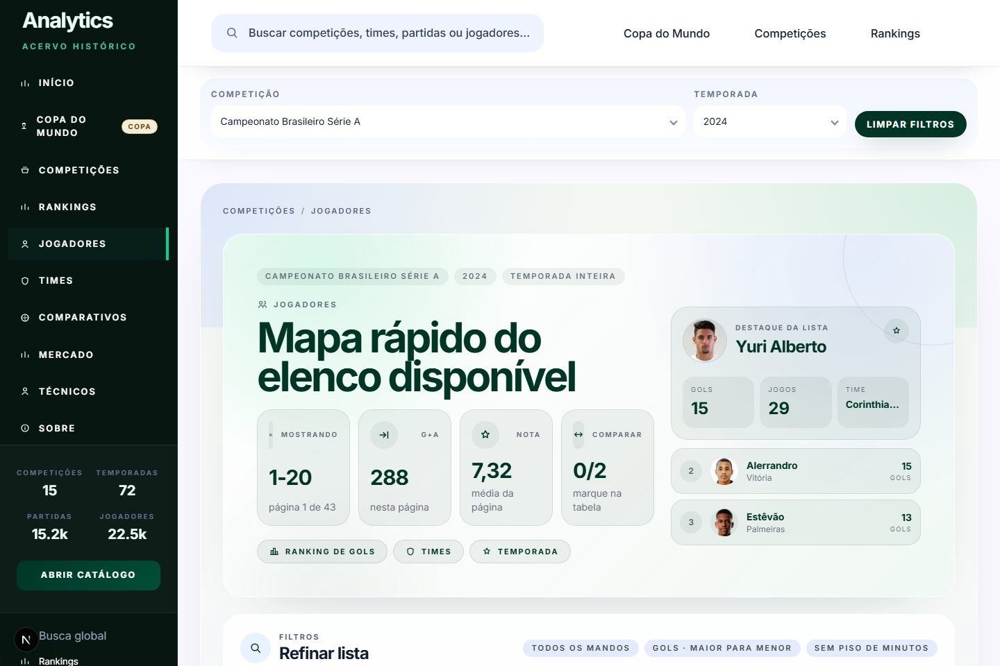
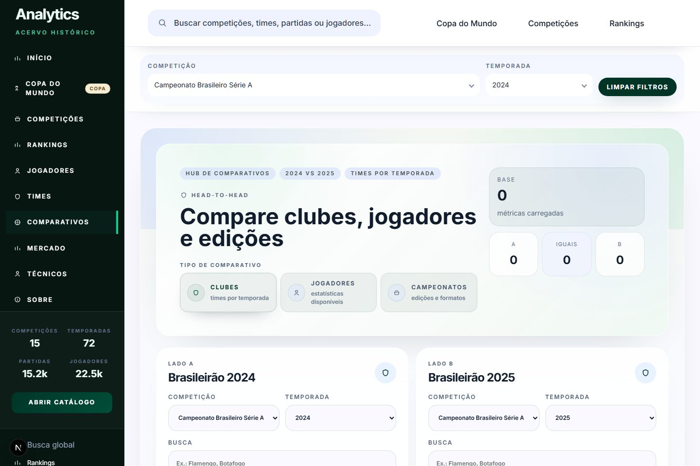
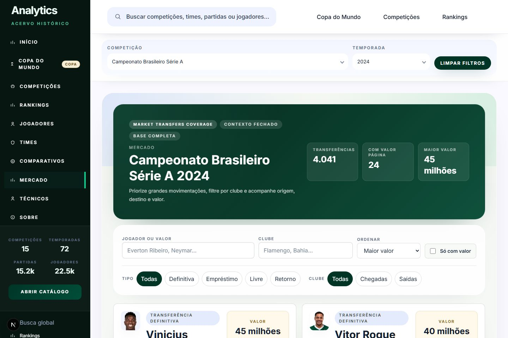

<div align="center">

# Football Analytics

**Uma plataforma para transformar dados de futebol em leitura competitiva: competições, temporadas, partidas, rankings, jogadores, times, mercado e Copa do Mundo em uma navegação única.**

[](https://football-analytics-victor-hugos-projects-f5572824.vercel.app)

[Football Analytics](https://football-analytics-victor-hugos-projects-f5572824.vercel.app) · [Repositório](https://github.com/victorhob1981/football-analytics)

</div>



## O Produto

Football Analytics é uma experiência de análise para quem precisa entender futebol com contexto, velocidade e profundidade. A plataforma conecta competições, temporadas, partidas, times e jogadores em um fluxo contínuo: você começa em uma liga, abre uma edição, compara rankings, entra na central da partida e segue para perfis individuais sem perder os filtros de análise.

A proposta é simples: sair da leitura fragmentada e entregar uma interface em que scouting, performance, conteúdo e inteligência de mercado conseguem navegar pelo mesmo universo de dados.

## Para Quem

- Analistas de desempenho que precisam comparar times, jogadores e partidas com rapidez.
- Profissionais de scouting que querem encontrar destaques e validar contexto competitivo.
- Conteúdo e mídia esportiva que precisam transformar números em histórias claras.
- Gestão esportiva que acompanha elenco, mercado, campanhas e histórico competitivo.
- Times de produto e dados que precisam de uma base visual pronta para exploração futebolística.

## O Que Você Consegue Fazer

- Explorar competições nacionais, continentais e globais com temporadas organizadas.
- Entrar em partidas e navegar por placar, escalações, eventos e estatísticas disponíveis.
- Comparar rankings de jogadores e times por gols, assistências, finalizações, nota, cartões, posse e passe.
- Abrir perfis de times e jogadores mantendo competição e temporada selecionadas.
- Analisar confrontos diretos entre equipes dentro do mesmo contexto competitivo.
- Acompanhar movimentações de mercado com filtros por clube, direção e tipo de transferência.
- Explorar uma vertical dedicada da Copa do Mundo com edições, seleções, finais e recordes históricos.

## Galeria do Produto

<table>
  <tr>
    <td width="33%"><strong>Competições</strong><br /></td>
    <td width="33%"><strong>Copa do Mundo</strong><br /></td>
    <td width="33%"><strong>Rankings</strong><br /></td>
  </tr>
  <tr>
    <td width="33%"><strong>Partidas</strong><br /></td>
    <td width="33%"><strong>Times</strong><br /></td>
    <td width="33%"><strong>Jogadores</strong><br /></td>
  </tr>
  <tr>
    <td width="33%"><strong>Comparativos</strong><br /></td>
    <td width="33%"><strong>Mercado</strong><br /></td>
    <td width="33%"><strong>Início</strong><br /></td>
  </tr>
</table>

## Áreas Principais

### Competições e Temporadas

O catálogo organiza campeonatos por país, região, tipo e temporada. Cada competição abre uma jornada própria: histórico, edições disponíveis, calendário, estrutura, rankings e caminhos para times, jogadores e partidas.

### Central da Partida

A partida deixa de ser apenas placar. A central reúne contexto competitivo, escalações, estatísticas de equipe, eventos e destaques individuais quando os dados estão disponíveis.

### Rankings

O hub de rankings serve como ponto de entrada para descobrir líderes e outliers. A experiência permite alternar entre leituras individuais e coletivas, preservando competição, temporada e filtros ativos.

### Times e Jogadores

Perfis conectam desempenho, participação, histórico, partidas e rankings. A navegação foi desenhada para responder rápido: quem se destacou, em qual contexto e contra qual nível de oposição.

### Comparativos

O confronto direto ajuda a colocar dois times lado a lado, com leitura de força relativa, histórico recente e atalhos para partidas e perfis relacionados.

### Mercado

A área de mercado consolida transferências de jogadores com filtros por clube, direção e tipo de movimentação. É um ponto de apoio para acompanhar construção de elenco e movimentações relevantes.

### Copa do Mundo

A Copa do Mundo tem uma área própria, com linha do tempo de edições, seleções, finais e recordes históricos. É uma experiência separada das competições de clubes para preservar o contexto do torneio.

## Números da Plataforma

| Métrica | Cobertura atual |
| --- | ---: |
| Competições disponíveis | 15 |
| Temporadas organizadas | 72 |
| Partidas navegáveis | 15k+ |
| Jogadores catalogados | 22k+ |
| Rankings disponíveis | 8 |
| Áreas de navegação | 9 |

## Por Que Ele Se Destaca

- **Contexto preservado:** filtros acompanham a navegação entre competições, partidas, rankings, times e jogadores.
- **Leitura multidimensional:** a mesma temporada pode ser vista por calendário, tabela, elenco, ranking, partida ou perfil.
- **Produto pronto para demonstração:** interface visual, dados conectados e caminhos de navegação consistentes.
- **Arquitetura preparada para evoluir:** frontend, API, banco, orquestração e BI trabalham como uma base única de produto.
- **Foco em decisão:** cada tela foi desenhada para reduzir ruído e acelerar a leitura do futebol.

## Stack


## Experiência Técnica

A interface é construída em Next.js e React, com uma API em FastAPI servindo dados prontos para consumo. A base analítica roda sobre PostgreSQL, com orquestração, transformação e validações para manter as páginas consistentes.

```text
Dados de futebol -> Transformação -> API de produto -> Interface web -> BI
```

## Rodando Localmente

<details>
<summary>Ver instruções para desenvolvimento</summary>

### 1. Infraestrutura base

```powershell
docker compose up -d postgres dbmate minio airflow-init airflow-webserver airflow-scheduler metabase
```

### 2. API

```powershell
python -m pip install -r api/requirements.txt
uvicorn api.src.main:app --reload
```

### 3. Frontend

```powershell
cd frontend
pnpm install
pnpm dev -- --port 3001
```

### 4. Endereços locais

| Serviço | URL |
| --- | --- |
| App | `http://localhost:3001` |
| API docs | `http://127.0.0.1:8000/docs` |
| Health | `http://127.0.0.1:8000/health` |
| Airflow | `http://localhost:8080` |
| Metabase | `http://localhost:3000` |

</details>

## Validação

```powershell
cd frontend
pnpm typecheck
```

```powershell
python tools/frontend_release_gate.py
python tools/backend_data_readiness_gate.py
```

## Próximo Passo

A forma mais rápida de entender o produto é abrir a versão web e navegar por uma competição completa.

<div align="center">

[**Acessar Football Analytics**](https://football-analytics-victor-hugos-projects-f5572824.vercel.app)

</div>
