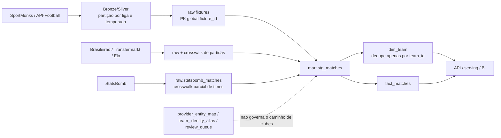

# Diagnóstico da duplicação multifonte de clubes e plano de normalização

- **Status:** diagnóstico concluído; correção não executada
- **Data da análise:** 2026-07-15
- **Revisão do repositório:** `484c410`
- **Ambiente consultado:** PostgreSQL local `football_dw`, alimentado pelo snapshot serving do projeto
- **Escopo desta entrega:** análise de engenharia de dados e plano de execução para outro agente

> Este documento não altera código, banco, objetos do storage ou dados. Ele registra o estado observado, separa fatos de hipóteses e define uma sequência segura para impedir novas duplicações e normalizar o histórico.

## 1. Resumo executivo

A existência de quatro registros de Flamengo não é uma duplicação física causada por quatro inserções da mesma chave. É uma duplicação semântica: quatro identificadores técnicos distintos representam o mesmo clube.

O mecanismo principal está confirmado:

1. As fontes carregam seus próprios identificadores — ou apenas nomes — sem passar por uma resolução canônica de clube.
2. A definição ativa de `mart.stg_matches` cria identificadores externos a partir de `fonte + competição + grafia do nome`.
3. `mart.dim_team` considera cada `team_id` distinto uma entidade válida e deduplica somente dentro do próprio `team_id`.
4. Os testes atuais comprovam unicidade técnica de `team_id` e `team_sk`, mas não comprovam unicidade semântica do clube.
5. As estruturas de crosswalk e revisão existentes não estão ligadas ao caminho que publica clubes.
6. Materializações incrementais preservam identidades antigas e não reprocessam todo o histórico quando um mapeamento muda.

O caso Flamengo observado no banco é:

| `team_id` | Nome publicado | Fonte dos jogos | Jogos como mandante ou visitante | Intervalo observado |
| ---: | --- | --- | ---: | --- |
| 1024 | Flamengo | sportmonks | 290 | 2021-04-21 a 2025-12-06 |
| 990561002513 | Flamengo | dataset_brasileirao | 710 | 2003-03-30 a 2023-11-26 |
| 1048633958805 | Clube de Regatas do Flamengo | transfermarkt | 17 | 2026-01-29 a 2026-05-30 |
| 1049232567028 | Flamengo RJ | eloratings | 189 | 2012-01-07 a 2024-12-07 |

As quatro identidades somam 1.206 referências de lado de partida em `mart.fact_matches`. A recomputação da fórmula ativa reproduz exatamente os três IDs externos.

Há ainda uma segunda falha, independente da identidade de clube: partidas classificadas como `new_coverage` e `pending` entram em `external_match_publication_xref` como `publishable`. Foram encontrados 1.198 candidatos fortes a partidas duplicadas e seis duplicações confirmadas envolvendo Flamengo e América-MG. Portanto, a normalização precisa separar duas operações:

- unificar identidades de clube sem perder fatos;
- suprimir somente partidas comprovadamente duplicadas, sem somar duas vezes o mesmo jogo.

Há 240.993 registros de origem de partida em `pending + publishable`. Fechar esse gate sem antes reclassificar a cobertura poderia retirar grande parte do histórico; o plano exige um manifesto próprio de partidas e aceite explícito do delta.

O caminho seguro é corrigir primeiro o contrato de identidade e os gates de publicação, gerar um manifesto auditável de remapeamento, reprocessar em esquema sombra com `full refresh` e só então fazer o corte. Atualizações manuais em massa nas tabelas atuais ou uma execução incremental comum não são suficientes.

## 2. Escopo, método e limitações

### 2.1 Perguntas respondidas

Esta análise procurou responder:

1. Em que ponto a identidade de um clube deixa de ser resolvida entre fontes?
2. Que mecanismo gera os quatro Flamengos?
3. Que barreiras existem hoje e por que não funcionam?
4. Qual é o alcance da duplicação além do exemplo?
5. Que fatos dependem dos IDs duplicados?
6. Como impedir recorrência e normalizar o histórico com rollback e validação?

### 2.2 Método

Foram usados quatro recortes de evidência:

- **Código:** adaptadores, mapeadores, cargas, modelos dbt, scripts de reconciliação, migrações e publicação de snapshot.
- **Dados:** consultas somente leitura em `raw`, `control` e `mart`.
- **Auditoria:** estados de crosswalk, filas de revisão, confiança e evidências persistidas.
- **Operação:** materializações incrementais, restauração de snapshot e diferença entre a view ativa e o SQL versionado.

### 2.3 Limitações

- O banco consultado é o serving local, não foi afirmado que ele seja uma cópia atual da produção ou do warehouse de origem.
- O HEAD era `484c410`, com alterações pré-existentes não relacionadas em API/frontend; os arquivos de pipeline/dbt citados foram lidos no estado atual e não foram alterados por esta análise.
- Não foram chamadas APIs externas nem conferidos cadastros diretamente nos provedores.
- Grupos encontrados por nome normalizado são uma fila de candidatos, não autorização de merge. Clubes masculinos, femininos, de base, seleções e homônimos podem compartilhar nomes.
- As contagens registram o snapshot observado em 2026-07-15 e devem ser recalculadas imediatamente antes de qualquer execução.
- Nenhuma conclusão deste relatório autoriza apagar dados raw.

### 2.4 Convenções

- **Confirmado:** reproduzido em código e/ou consulta objetiva.
- **Candidato:** evidência forte, mas requer decisão de identidade.
- **Risco estrutural:** desenho capaz de produzir corrupção ou duplicação, ainda que não seja a causa comprovada do caso Flamengo atual.
- **Refutado:** hipótese incompatível com a evidência observada.

## 3. Arquitetura atual relevante

O fluxo efetivo mistura duas famílias de ingestão:



O campo de fonte existe em várias linhas, mas não compõe de forma consistente o grão físico do pipeline. Ao mesmo tempo, no caminho dos datasets externos, a fonte participa da geração de uma nova identidade. O resultado é assimétrico:

- em alguns pontos, IDs iguais de fontes diferentes podem colidir;
- em outros, o mesmo clube ganha IDs diferentes justamente por vir de fontes diferentes.

## 4. Fatos confirmados

### F1. Os quatro Flamengos representam a mesma entidade de negócio

Além dos nomes e das competições, a proveniência confirma quatro segmentos temporais do mesmo clube. A tabela raw do Transfermarkt registra `club_id = 614`, `club_code = flamengo-rio-de-janeiro` e nome `Clube de Regatas do Flamengo` na competição doméstica brasileira.

Ocorrências de rótulo nas fontes raw:

| Fonte | Rótulo | Ocorrências |
| --- | --- | ---: |
| dataset_brasileirao | Flamengo | 894 |
| eloratings | Flamengo RJ | 485 |
| transfermarkt | Clube de Regatas do Flamengo | 63 |

O ID 1024 é o candidato recomendado a sobrevivente para este caso porque já é o ID SportMonks, possui a maior profundidade de fatos relacionados e minimiza o remapeamento de eventos, escalações e estatísticas. Isso ainda deve ser registrado como decisão explícita no manifesto de merge; não deve ser inferido silenciosamente pelo código.

### F2. A view ativa fabrica identidades por fonte, competição e grafia

A definição ativa de `mart.stg_matches` contém CTEs para Brasileirão, Transfermarkt e Elo e calcula IDs externos de forma equivalente a:

```text
960200000000
+ (md5(provider + ':' + competition_key + ':' + lower(trim(team_name)))
   mod 99999999999)
```

Recomputações confirmadas:

| Entrada semântica | ID gerado |
| --- | ---: |
| `dataset_brasileirao:brasileirao_a:flamengo` | 990561002513 |
| `transfermarkt:brasileirao_a:clube de regatas do flamengo` | 1048633958805 |
| `eloratings:brasileirao_a:flamengo rj` | 1049232567028 |

A fórmula não é um crosswalk. Ela transforma cada combinação de `provider + competition_key + nome` em uma chave determinística sem resolver equivalência semântica. No caso observado, as combinações geraram IDs distintos. Em geral, mudar fonte, competição ou grafia tende a dividir o mesmo clube, mas não há garantia matemática de unicidade: o MD5 é truncado e reduzido por módulo, portanto também admite colisões técnicas entre entradas diferentes.

Exemplo confirmado do último caso: o Transfermarkt publica `Arsenal Football Club` como `977675131048` na Champions League e `1044165519576` na Premier League.

### F3. A duplicação é sistêmica, não isolada no Flamengo

Inventário de `mart.dim_team`:

| Métrica | Resultado |
| --- | ---: |
| Linhas | 3.060 |
| `team_id` distintos | 3.060 |
| `team_sk` distintos | 3.060 |
| Nomes distintos após `lower(trim())` | 2.190 |
| Grupos com nome exato repetido | 574 |
| IDs excedentes nesses grupos | 870 |
| Maior quantidade de IDs no mesmo nome exato | 5 |
| Grupos de nome exato cruzando fontes | 306 |
| Grupos de nome exato dentro de uma só fonte | 268 |

Ao aplicar à `dim_team` a função `team_signature` existente em `platform/scripts/reconcile_external_match_xrefs.py`, foram encontrados 597 grupos candidatos, abrangendo 1.609 linhas. Desses, 363 cruzam fontes e 354 contêm repetição dentro da mesma fonte; os subconjuntos se sobrepõem e não formam uma partição.

Esses números têm funções diferentes:

- os 574 grupos medem repetição exata de nome normalizado;
- os 597 grupos ampliam a busca com heurística;
- nenhum dos dois conjuntos pode ser convertido automaticamente em merges.

### F4. A dimensão garante unicidade técnica, não identidade canônica

Em `platform/dbt/models/marts/core/dim_team.sql:10-64`:

- times são coletados das partidas e eventos;
- a janela particiona apenas por `team_id`;
- `team_sk` é `md5('team:' + team_id)`;
- a materialização é incremental por `team_sk`.

Em `platform/dbt/models/marts/core/schema.yml:4-20`, os testes verificam `not_null` e `unique` para `team_id` e `team_sk`. Os quatro Flamengos passam nesses testes porque todos os IDs são diferentes.

No banco local, `mart.dim_team` não possui PK ou UNIQUE; há apenas índice btree comum em `team_id`. Também não existem FKs das tabelas de fatos para a dimensão. As duas lacunas são distintas:

- mesmo uma constraint UNIQUE em `team_id` não impediria quatro IDs semânticos;
- a ausência de constraints permite ainda inconsistências referenciais que os modelos precisam detectar por teste.

### F5. As estruturas de identidade existentes não barram a publicação

Há três componentes reutilizáveis, mas eles não formam um fluxo de identidade de time:

1. `raw.provider_entity_map(provider, entity_type, source_id, canonical_id)` existe desde `db/migrations/20260218190000_provider_foundation.sql:2-13`.
2. `mart.team_identity_alias` existe desde `db/migrations/20260425160000_coach_identity_alias_layer.sql:2-46`.
3. `control.entity_reconciliation_review_queue` aceita `entity_type = 'team'` desde `db/migrations/20260620221000_reconciliation_audit_foundation.sql:55-83`.

Estado observado:

| Componente | Estado |
| --- | --- |
| `provider_entity_map` | somente StatsBomb: 64 matches, 233 players e 13 teams |
| `team_identity_alias` | 0 linhas |
| fila de revisão para `team` | 0 linhas |
| consumo de `team_identity_alias` pelos modelos dbt/API | nenhum |
| crosswalk específico de time para Brasileirão/TM/Elo | inexistente |

Logo, a existência das tabelas não constitui um gate. O caminho de publicação não exige um mapeamento aprovado.

### F6. O bridge do StatsBomb é calculado, mas ignorado no staging

`mart.stg_statsbomb_team_identity` contém:

- 13 times `linked_to_sportmonks` com `local_team_id`;
- 336 identidades não resolvidas.

Apesar disso, `platform/dbt/models/staging/stg_matches.sql:144-147` sempre usa:

```sql
910000000000 + home_team_id
910000000000 + away_team_id
```

Foram confirmados nove pares em que já existe `local_team_id`, mas o fato ainda usa o ID sintético. Entre eles estão Toulouse, Rennes, Montpellier, Nantes, Paris Saint-Germain, Saint-Étienne, Lorient, Bordeaux e Troyes. Exemplos:

| Time | ID local | ID sintético publicado |
| --- | ---: | ---: |
| Toulouse | 289 | 910000000130 |
| Rennes | 598 | 910000000134 |

Há 338 referências de lado de partida, distribuídas por 268 partidas sintéticas, envolvendo nove dos 13 times já mapeados. Isso contradiz o próprio plano de pré-ingestão, que determinava não criar novo `dim_team` para um time StatsBomb já resolvido, em `platform/reports/quality/statsbomb_open_data_preingestion_plan.md:231-249` e `:282-294`.

### F7. Há drift entre o código versionado e o banco ativo

`platform/dbt/models/staging/stg_matches.sql:1-162` contém apenas:

- `raw.fixtures`;
- `raw.statsbomb_matches`.

A view ativa retornada por `pg_get_viewdef('mart.stg_matches'::regclass, true)` contém também:

- `brasileirao_external`;
- `transfermarkt_external`;
- `eloratings_external_base`;
- a fórmula sintética dos IDs externos.

Portanto, o SQL versionado no HEAD analisado não é capaz de reproduzir sozinho a relação ativa.

O mecanismo operacional explica como o drift pode persistir:

- `tools/start-local.ps1:278-313` restaura `artifacts/football_serving_20260426.dump` quando o banco serving está vazio;
- `tools/start-local.ps1:431-449` não rematerializa os resumos quando já há dados;
- o artifact não é a fonte versionada do modelo.

É obrigatório resolver esse drift antes de implementar a correção. Corrigir somente o arquivo local sem saber qual definição gerou o banco, ou corrigir somente o snapshot, produziria duas verdades concorrentes.

### F8. O pipeline principal possui grãos incompatíveis com múltiplos provedores

Nos adaptadores de API:

- `infra/airflow/dags/common/providers/registry.py:9-23` e `:63-76` suportam SportMonks e API-Football;
- `infra/airflow/dags/common/mappers/fixtures_mapper.py:25-59` preserva IDs nativos e a fonte;
- `infra/airflow/dags/common/mappers/fixtures_mapper.py:64-74` deduplica apenas por `fixture_id`.

No storage e warehouse:

- os prefixos são `fixtures/league=<id>/season=<ano>/`, sem o provedor, em `ingestion_service.py:511-570`, `mapping_service.py:241-272` e `warehouse_service.py:2116-2132`;
- `warehouse_service.py:2191-2195` deduplica por `fixture_id`;
- `warehouse_service.py:2242-2247` faz `ON CONFLICT (fixture_id)`;
- `raw.fixtures` possui PK global em `fixture_id` desde `db/migrations/20260217120000_baseline_schema.sql:6-30`; a adição posterior de `provider` não alterou a chave.

Consequências possíveis:

- mesmo número de fixture em provedores diferentes pode sobrescrever ou fundir jogos distintos;
- prefixos iguais de liga/temporada podem misturar execuções de provedores;
- IDs nativos de time são tratados como globais em caminhos que não incluem a fonte.

Isso é um risco estrutural confirmado no código, mas não é a causa direta comprovada dos quatro Flamengos atuais. Neste caso, os três IDs externos vieram da fórmula ativa.

### F9. O incremental impede uma correção histórica completa

- `dim_team` é incremental por `team_sk`. Quando uma identidade deixa de ser produzida, o dbt não apaga automaticamente a linha antiga.
- `fact_matches` é incremental por `match_id` e usa lookback de 24 horas em `platform/dbt/models/marts/core/fact_matches.sql:16` e `:58-69`.
- `infra/airflow/dags/dbt_run.py:48-64` executa o DAG sem `--full-refresh`.

Foram observados cinco IDs StatsBomb em `dim_team` que já não aparecem no `stg_matches` atual:

| `team_id` | Nome |
| ---: | --- |
| 910000000158 | AC Ajaccio |
| 910000000182 | RB Leipzig |
| 910000000183 | Freiburg |
| 910000000190 | Union Berlin |
| 910000000201 | FC Heidenheim |

Esse é um sintoma confirmado de permanência incremental. Uma simples mudança no staging seguida do DAG normal não normalizará o passado.

### F10. O snapshot de serving propaga o problema e omite sua linhagem

`db/publication/load_serving_subset_from_source.sql:51-109` importa dimensões, fatos e parte de raw, mas não importa:

- `raw.provider_entity_map`;
- `mart.team_identity_alias`;
- bridges de identidade de time;
- fila e decisões necessárias para explicar o merge.

Os times do escopo são derivados dos fatos e `dim_team` é copiada como está. `db/publication/validate_serving_snapshot.sql:7-135` valida objetos, escopo, órfãos e contagens, mas não testa duplicação semântica de clube.

Logo, o snapshot consegue ser tecnicamente válido e ainda publicar quatro Flamengos.

### F11. A API reflete o problema; não o cria

As rotas e resumos consultam os IDs já publicados. Elas devolvem quatro registros e fragmentam as métricas em 710, 290, 189 e 17 jogos. Não foi encontrado código da API que duplique entidades na escrita.

Corrigir apenas busca, autocomplete ou apresentação esconderia o defeito sem normalizar fatos e agregados.

## 5. Falha separada: duplicação semântica de partidas

### 5.1 Como o gate vaza

Em `platform/scripts/reconcile_external_match_xrefs.py:392-437`:

- candidatos muito fortes viram `linked_to_sportmonks / auto_approved`;
- casos ambíguos próximos viram `ambiguous / manual_review`;
- o restante cai em `new_coverage / pending`, mesmo quando existe um melhor `localMatchId` com evidência relevante.

Em `platform/scripts/build_external_match_publication_xref.py:166-226`:

- todos os registros com `identity_status = 'new_coverage'` são carregados;
- `review_status` não é filtrado;
- a deduplicação posterior compara apenas fontes externas entre si.

Estado observado:

| Fonte | Ligados automaticamente ao local | `pending + publishable` | `pending + suppressed_duplicate` |
| --- | ---: | ---: | ---: |
| dataset_brasileirao | 1.786 | 7.379 | 0 |
| eloratings | 6.909 | 207.773 | 15.875 |
| transfermarkt | 6.787 | 25.841 | 4 |

O problema não é a existência de revisão pendente. O builder ignora `review_status`, permitindo que `pending` vire `publishable`; apenas parte dessas linhas é suprimida pela deduplicação posterior entre fontes externas.

### 5.2 Candidatos fortes e casos confirmados

Critério usado para inventário:

- publicação ativa;
- `localMatchId` candidato presente na evidência;
- mesma data, com `dayDelta = 0`;
- placar exato;
- confiança maior ou igual a 0,85.

Resultado:

| Fonte | Candidatos prováveis |
| --- | ---: |
| dataset_brasileirao | 99 |
| eloratings | 877 |
| transfermarkt | 222 |
| **Total** | **1.198** |

Os 1.198 são candidatos para auditoria, não uma lista de exclusão automática.

Seis casos Flamengo x América-MG estão confirmados pelo conjunto de evidências: mesma competição, data e placar, `localMatchId` candidato persistido pela reconciliação, nomes semanticamente equivalentes e as duas linhas presentes no fato.

| Data | Partida externa | Partida local SportMonks | Placar |
| --- | ---: | ---: | --- |
| 2021-06-13 | 920000007290 | 17958501 | 2–0 |
| 2021-09-26 | 920000007479 | 17958694 | 1–1 |
| 2022-06-25 | 920000007778 | 18489524 | 3–0 |
| 2022-10-22 | 920000007967 | 18489713 | 1–2 |
| 2023-07-22 | 920000008177 | 18791189 | 1–1 |
| 2023-11-26 | 920000008371 | 18791388 | 0–3 |

O pareamento não passou pelo limiar automático porque `America-MG` e `América Mineiro` tiveram similaridade de aproximadamente 0,72.

### 5.3 Regra de segurança

Unificar quatro IDs de Flamengo não autoriza somar todas as suas partidas. O executor deve:

1. resolver a identidade dos dois clubes;
2. reconciliar a identidade da partida usando os times canônicos;
3. manter uma única partida quando a duplicidade for aprovada;
4. preservar a origem da linha suprimida e a referência `duplicate_of`.

## 6. Diagnóstico por eixo

| Eixo | Diagnóstico | Severidade |
| --- | --- | --- |
| Dados | IDs de fonte e IDs canônicos são tratados como a mesma coisa | Crítica |
| Código | hash trata cada combinação de fonte/competição/nome como identidade independente e produziu o split observado | Crítica |
| Código | `dim_team` nasce dos fatos e deduplica apenas por ID | Crítica |
| Auditoria | publicação de time não depende de crosswalk aprovado | Crítica |
| Auditoria | `pending` de partida pode virar `publishable` | Crítica |
| Operação | view ativa não é reproduzível pelo SQL versionado | Crítica |
| Operação | incrementais retêm IDs aposentados e não rekeyam o histórico | Alta |
| Ingestão | partições e PK de fixtures não incluem provedor | Alta, risco estrutural |
| Banco | ausência de FK/constraints deixa órfãos para testes tardios | Média |
| Serving | snapshot publica dimensões sem a linhagem de identidade | Alta |

## 7. Hipóteses testadas

| Hipótese | Veredito | Evidência |
| --- | --- | --- |
| Os quatro Flamengos são inserções físicas repetidas da mesma chave | **Refutada** | 3.060 linhas, 3.060 `team_id` e 3.060 `team_sk` distintos |
| O mesmo clube foi dividido por fonte e grafia | **Confirmada** | proveniência e recomputação exata dos IDs |
| A fórmula externa é a causa imediata dos três IDs adicionais | **Confirmada** | os três resultados batem com `mart.dim_team` |
| A fórmula também duplica dentro da mesma fonte por competição | **Confirmada** | dois IDs Transfermarkt para Arsenal |
| `provider_entity_map` bloqueia a publicação sem mapeamento | **Refutada** | tabela não é consumida pelo staging externo e só possui mapeamento StatsBomb |
| `team_identity_alias` já resolve o problema | **Refutada** | 0 linhas e nenhum consumo por dbt/API |
| O bridge StatsBomb evita IDs sintéticos quando há `local_team_id` | **Refutada** | nove pares resolvidos ainda publicados com offset |
| Os testes atuais detectam entidade semântica duplicada | **Refutada** | testam chaves técnicas, que são únicas |
| A API é a origem da duplicação | **Refutada** | somente lê e fragmenta os IDs existentes |
| Corrida de DAG causou os quatro Flamengos | **Refutada para este caso** | IDs são determinísticos e distintos por fórmula; concorrência permanece risco secundário |
| Todos os 574/597 grupos devem ser fundidos | **Não comprovada** | nome não distingue gênero, categoria, país e homônimos |
| Todos os 1.198 jogos devem ser apagados | **Não comprovada** | são candidatos fortes; exigem decisão auditável |
| Os seis Flamengo x América-MG são o mesmo jogo | **Confirmada** | data, placar, competição, candidato local e presença dupla |
| O repositório atual reproduz o banco ativo | **Refutada** | `pg_get_viewdef` contém SQL ausente do arquivo dbt |

## 8. Impacto referencial do caso Flamengo

### 8.1 Fragmentação por ID

| ID | `fact_matches` mandante | `fact_matches` visitante | Cubo OLAP | Elo | Fatos profundos |
| ---: | ---: | ---: | ---: | ---: | --- |
| 1024 | 144 | 146 | 292 | 84 | eventos, lineups, player stats, standings, ties |
| 990561002513 | 354 | 356 | 773 | 0 | sem profundidade equivalente observada |
| 1048633958805 | 8 | 9 | 20 | 0 | sem profundidade equivalente observada |
| 1049232567028 | 90 | 99 | 52 | 148 | estatística Elo |

### 8.2 Relações que referenciam os quatro IDs

As contagens abaixo são por relação e não devem ser somadas como se fossem fatos independentes, pois vários marts são derivados.

| Relação | Coluna ou papel | Linhas |
| --- | --- | ---: |
| `mart.dim_team` | ID/SK | 4 |
| `mart.fact_matches` | home | 596 |
| `mart.fact_matches` | away | 610 |
| `mart.analytics_olap_metric_cube` | team | 1.137 |
| `mart.fact_elo_match_team_stats` | ID/SK | 232 |
| `mart.fact_fixture_lineups` | ID/SK | 6.625 |
| `mart.fact_fixture_player_stats` | ID/SK | 6.622 |
| `mart.fact_match_events` | ID/SK | 2.662 |
| `mart.player_match_summary` | ID/SK | 6.622 |
| `mart.fact_group_standings` | team | 5 |
| `mart.fact_standings_snapshots` | ID/SK | 10 |
| `mart.fact_stage_progression` | team | 19 |
| `mart.dim_tie` | home / away / winner | 17 / 20 / 31 |
| `mart.fact_tie_results` | home / away / winner | 17 / 20 / 31 |
| `mart.player_serving_summary` | team | 72 |

Implicações:

- rekey parcial quebrará consistência entre `team_id` e `team_sk`;
- update direto sem tratar constraints de grão pode gerar colisões;
- apagar os IDs externos antes de reconstruir dependentes causa perda aparente;
- fundir partidas duplicadas sem linhagem altera contagens de forma não auditável;
- métricas por clube continuarão divergentes enquanto serving e cubos não forem reconstruídos.

## 9. Causa raiz e fatores contribuintes

### 9.1 Causa raiz

O pipeline não possui uma fronteira obrigatória entre **identidade da fonte** e **identidade canônica de clube**.

Um ID de fonte ou um hash de nome entra no modelo como se já fosse um `canonical_team_id`. Como `dim_team` é derivada das partidas, ela legitima qualquer ID que o staging entregue.

### 9.2 Cadeia causal

1. A fonte fornece um ID próprio ou apenas um nome.
2. Não há resolução obrigatória contra um cadastro canônico.
3. O staging preserva o ID nativo ou cria um hash por fonte/competição/nome.
4. `dim_team` cria uma linha para cada ID.
5. Os testes de unicidade técnica passam.
6. `fact_matches` e derivados gravam os IDs distintos.
7. O incremental mantém identidades aposentadas.
8. O snapshot e a API publicam a fragmentação.

Em paralelo, uma partida externa pendente pode ser publicada como cobertura nova, duplicando também o fato de jogo.

### 9.3 Fatores contribuintes

- ausência de contexto de identidade: país, gênero, categoria e tipo do time;
- competição usada como parte da identidade do clube;
- nomes usados como chave, embora sejam atributos mutáveis;
- crosswalks existentes sem consumo obrigatório;
- drift entre artifact, banco e dbt versionado;
- ausência de teste semântico e de gate de publicação;
- grão `fixture_id` global em uma ingestão que aceita múltiplos provedores.

## 10. Contrato de identidade recomendado

O executor deve estabelecer um único contrato antes de mexer no histórico.

### 10.1 Entidades e chaves

| Conceito | Regra |
| --- | --- |
| `source_team_id` | identificador original, sempre preservado com `provider` |
| `source_team_key` | chave contextual para fontes sem ID estável |
| `canonical_team_id` | identificador interno estável, independente de fonte, nome e competição |
| `canonical_name` | atributo editorial; não é chave única |
| alias | rótulo observado numa fonte, ligado ao time canônico |
| decisão | status, método, confiança, evidência, autor/data e eventual substituição |

Para entidades já publicadas, deve-se preservar como sobrevivente um ID existente quando a evidência e o menor impacto justificarem. Isso não torna o provedor dono da identidade: depois de canonizado, o ID é interno. Times realmente novos devem receber ID por um alocador interno estável, nunca por hash de fonte, competição ou nome.

### 10.2 Reuso mínimo das estruturas existentes

Para evitar duas soluções concorrentes:

- criar um cadastro controlado de times canônicos como fonte de verdade; `dim_team` passa a ser saída desse cadastro, não a descoberta automática a partir de fatos;
- reutilizar `raw.provider_entity_map` somente para mapeamentos **aprovados** de ID de fonte para ID canônico;
- reutilizar `control.entity_reconciliation_review_queue` para candidatos, pendências e decisões humanas;
- reutilizar `mart.team_identity_alias` para aliases de nomes, depois de conectá-la ao fluxo e reforçar sua integridade;
- não criar outro crosswalk paralelo com a mesma função.

Se a convenção arquitetural não permitir dados de controle em `raw`, o executor deve migrar `provider_entity_map` uma única vez para `control` e manter apenas uma view de compatibilidade. Não deve gravar simultaneamente em dois mapas independentes.

O cadastro canônico precisa, no mínimo, de:

- ID estável;
- nome canônico;
- país ou território;
- tipo: clube ou seleção;
- gênero;
- categoria: principal, base ou outra;
- status ativo/mesclado;
- `merged_into_team_id` para identidades aposentadas;
- timestamps e origem da decisão.

### 10.3 Fontes com e sem ID

| Fonte | Chave de origem recomendada |
| --- | --- |
| SportMonks | `provider + team_id` |
| API-Football | `provider + team_id` |
| StatsBomb | `statsbomb_open_data + source_team_id` |
| Transfermarkt | `transfermarkt + club_id`; para Flamengo, `614` |
| Brasileirão por CSV | chave de entidade controlada por nome original + contexto do clube |
| EloRatings | chave de entidade controlada por nome original + contexto do clube |

Para fontes sem ID:

- competição e temporada podem ser evidência, mas não devem fazer parte do ID canônico;
- múltiplos aliases podem apontar para o mesmo clube;
- nome normalizado sozinho nunca deve promover automaticamente um merge ambíguo;
- itens não resolvidos devem ficar em quarentena, não ganhar identidade pública silenciosamente.

### 10.4 Estados mínimos

Um fluxo simples e suficiente:

```text
unresolved -> candidate -> approved
                      \-> rejected
                      \-> blocked
approved -> deprecated/merged
```

Somente `approved` pode alimentar o ID canônico publicado. “Nova cobertura” também precisa de aprovação automática por regra explícita ou aprovação manual; `pending` não é publicável.

## 11. Plano de correção e normalização

Cada fase abaixo possui um gate. O executor deve parar no primeiro gate não satisfeito em vez de compensar o problema com updates manuais.

O handoff atual é seguro para desenho, implementação isolada e dry run. Ele **não é autorização para mutar o histórico ou fazer cutover** até que os gates das fases 0, 2, 4 e 5 sejam satisfeitos.

### Fase 0 — Provar autoridade, completude e reversibilidade

**Objetivo:** demonstrar que o histórico pode ser reconstruído antes de tentar corrigi-lo.

**Ações:**

1. Registrar commit, migrations, definições ativas, contagens, checksums do raw e watermarks de todas as entradas.
2. Extrair e versionar a definição que atualmente produz os CTEs externos.
3. Decidir qual ambiente e conjunto de arquivos são a autoridade histórica.
4. Fazer backup lógico, guardar o esquema/snapshot anterior e ensaiar o restore.
5. Executar um rebuild clean-room **sem a correção** a partir das entradas declaradas.
6. Comparar esse rebuild com o baseline atual por chaves, contagens e métricas. Toda diferença deve ser explicada.
7. Escolher uma estratégia operacional:
   - **janela integral:** writers pausados da captura do baseline até o cutover; ou
   - **watermark/replay:** writers continuam durante o build, depois há freeze curto e replay determinístico do delta.
8. Definir RPO, RTO, duração máxima do freeze e gatilhos objetivos de rollback.

**Gate de saída:**

- o código versionado reproduz `mart.stg_matches`;
- o clean-room sem correção reproduz o baseline, ou existe reconciliação aprovada para cada diferença;
- todas as entradas necessárias ao `full refresh` estão completas;
- checksums raw, watermarks, RPO/RTO e estratégia de replay estão registrados;
- backup e retorno ao esquema anterior foram ensaiados.

**Rollback primário:** troca atômica de volta para o esquema/DB anterior, mantido intacto durante a janela. Restore de backup é contingência, não o primeiro mecanismo, porque pode perder writes posteriores ao baseline.

### Fase 1 — Instituir o contrato canônico e o fluxo de decisão

**Objetivo:** separar identidade de fonte de identidade de negócio sem ainda alterar os fatos.

**Ações:**

1. Criar o cadastro canônico com os atributos e estados da seção 10.
2. Definir o alocador interno de novos `canonical_team_id`.
3. Definir e versionar a gramática de `source_team_key` para Brasileirão/Elo e outras fontes sem ID:
   - provedor;
   - tipo da entidade;
   - nome original normalizado;
   - país/território;
   - gênero e categoria quando conhecidos;
   - sem competição ou temporada no ID canônico.
4. Formalizar um único mapa de links aprovados; usar `provider_entity_map` ou migrá-lo para `control`, sem escrita dupla.
5. Conectar `entity_reconciliation_review_queue` ao processo de times.
6. Usar `team_identity_alias` apenas como alias, nunca como autoridade, pois ela não possui contexto suficiente para decidir homônimos.
7. Adicionar integridade:
   - preservar/verificar a PK existente de `provider + entity_type + source_id`; se houver histórico/status, assegurar uma única versão ativa por identidade de origem;
   - FK ou teste equivalente do `canonical_id`;
   - uma única decisão ativa por identidade de fonte;
   - proibição de ciclo em `merged_into_team_id`.
8. Definir regras de autoaprovação somente quando a evidência for inequívoca.

**Gate de saída:**

- schema, migrations e regras são reproduzíveis em banco vazio;
- não existem dois mapas autoritativos;
- criação, merge, rejeição e rollback de uma identidade passam em testes;
- os casos Flamengo, Arsenal multi-competição, StatsBomb já ligado e um homônimo contextual passam como fixtures de contrato.

Este gate valida o mecanismo; ele não exige ainda que todo o histórico esteja aprovado.

### Fase 2 — Construir dois manifestos e aprovar o escopo

**Objetivo:** decidir o que será alterado antes de os produtores consumirem as decisões.

#### 2A. Manifesto de times

| Campo | Finalidade |
| --- | --- |
| `retired_team_id` | ID a aposentar |
| `survivor_team_id` | ID canônico |
| `provider/source_team_key` | origem preservada |
| `reason/method/confidence` | justificativa |
| `evidence` | dados usados na decisão |
| `classification` | merge, não-merge ou bloqueado |
| `affected_relation_counts` | previsão por tabela |
| `approved_by/approved_at` | auditoria |
| `rollback_key` | reversão |

Primeira decisão proposta para revisão:

| Origem | Identidade de origem | Canônico candidato |
| --- | --- | ---: |
| sportmonks | `team_id 1024` | 1024 |
| dataset_brasileirao | alias contextual `Flamengo` | 1024 |
| transfermarkt | `club_id 614` | 1024 |
| eloratings | alias contextual `Flamengo RJ` | 1024 |

Antes de aplicar qualquer onda, fazer o bootstrap dos 3.060 registros atuais de `dim_team` e de toda identidade de origem usada por uma partida publicada. Cada item precisa entrar no cadastro canônico com sua linhagem. Singletons sem sinal de conflito podem ser preservados por decisão `legacy_bootstrap`; grupos candidatos precisam de decisão de merge, não-merge ou bloqueio. O bootstrap preserva cobertura, mas não transforma automaticamente um ID legado em prova de identidade correta.

Gerar candidatos dos 574/597 grupos, enriquecer com contexto e classificá-los como `merge`, `não-merge` ou `bloqueado`. Executar em ondas:

1. Flamengo como canário;
2. links cross-provider de alta confiança;
3. duplicações dentro da mesma fonte;
4. casos textuais ambíguos.

Uma onda não precisa esperar a decisão de todos os grupos para ser construída e validada no esquema sombra, mas o canário não deve ir sozinho para produção. Antes do cutover global, todo o catálogo publicado deve estar no cadastro e todos os grupos candidatos devem ter decisão; bloqueios residuais precisam ser preservados como identidades separadas, quantificados e aceitos explicitamente, sem serem declarados “normalizados”.

#### 2B. Manifesto de partidas

O inventário atual possui **240.993 registros de origem de partida** em `pending + publishable`. Os 1.198 casos fortes são apenas a prioridade de auditoria; fechar o gate sem classificar o restante pode remover quase toda a cobertura externa.

Cada item ou grupo de partidas deve registrar:

| Campo | Finalidade |
| --- | --- |
| `canonical_match_id` | identidade final do jogo |
| `survivor_match_id` | linha factual sobrevivente |
| `source/source_match_id` | todas as origens |
| `classification` | linked, nova cobertura aprovada, duplicada, bloqueada ou rejeitada |
| `child_fact_inventory` | eventos, lineups, stats e outros filhos |
| `attribute_precedence` | qual fonte preserva cada atributo |
| `duplicate_of` | linhagem da linha suprimida |
| `expected_row_delta` | redução esperada |
| `method/confidence/evidence` | decisão auditável |
| `approved_by/approved_at` | auditoria |

O sobrevivente não deve ser escolhido apenas por prioridade nominal de fonte. Deve considerar profundidade e qualidade dos fatos filhos. Quando uma linha tiver melhores eventos e outra melhores atributos, o plano deve preservar a união compatível sem duplicar o jogo.

Classificar todo o conjunto `pending + publishable` em:

- nova cobertura autoaprovada por regra comprovada;
- link/duplicata de jogo já existente;
- revisão manual;
- bloqueado/rejeitado.

Reexecutar a reconciliação depois dos times canônicos, usando igualdade dos IDs canônicos como evidência principal. Auditar primeiro os seis casos Flamengo e os 1.198 candidatos fortes, mas produzir também o relatório de cobertura para os demais 239.795.

Antes do primeiro cutover, os 240.993 registros devem possuir decisão final. Não pode restar item simplesmente “fora da onda”. Um item bloqueado/rejeitado conta como retirada de cobertura no delta; manter cobertura exige uma decisão explícita e auditável de nova cobertura aprovada ou link para o fato local.

#### 2C. Dry run

1. Simular todo rekey e toda supressão.
2. Detectar colisões de grão depois do rekey.
3. Classificar colisões como mesmo fato, fatos distintos ou bloqueio.
4. Produzir contagens antes/depois por relação e por onda.
5. Obter aceite explícito do delta de cobertura.

**Gate de saída:**

- os 3.060 times atuais e todas as identidades de origem publicadas foram carregados no cadastro com linhagem;
- todo grupo candidato de time tem decisão ou bloqueio residual explicitamente aceito;
- times e partidas possuem manifestos separados;
- todos os 240.993 registros hoje `pending + publishable` têm decisão final; nenhum permanece apenas fora da onda;
- nenhuma relação será alterada fora do inventário;
- toda redução de linha tem `expected_row_delta`;
- o impacto de cobertura foi aceito antes de fechar `pending -> publishable`.

### Fase 3 — Corrigir produtores e gates em isolamento

**Objetivo:** impedir recorrência e fazer o código consumir os manifestos, ainda sem cutover.

**Ações de identidade de time:**

1. Fazer `stg_matches` expor separadamente:
   - `source_home_team_id/key` e `source_away_team_id/key`;
   - `canonical_home_team_id` e `canonical_away_team_id`;
   - status e método de resolução.
2. Remover a fórmula por fonte/competição/nome do papel de ID canônico. Ela pode existir apenas como chave provisória de origem.
3. No StatsBomb, usar `local_team_id` quando o bridge estiver aprovado.
4. Quarentenar lados não resolvidos conforme a política aprovada.
5. Fazer `dim_team` nascer do cadastro canônico.
6. Fazer `int_fact_matches_base` e derivados calcularem SKs a partir do ID canônico.

**Ações de identidade de partida:**

1. Fazer `linked_to_sportmonks` aprovado resolver para `local_fixture_id`; ele nunca deve gerar novo `canonical_external_match_id` nem novo fato.
2. Permitir ID externo e publicação somente para `new_coverage` com decisão `auto_approved/approved`.
3. Tornar `pending`, `manual_review`, `blocked` e `rejected` não publicáveis.
4. Persistir `duplicate_of`, método, confiança e evidência.
5. Preservar decisões humanas; não truncá-las em uma recomputação.
6. Tratar fatos filhos conforme o manifesto de partidas.

**Checks bloqueantes a implementar nesta fase:**

- ID de fonte publicado sem mapeamento;
- synthetic ID publicado apesar de bridge;
- time canônico inexistente;
- alias ativo conflitante no mesmo contexto;
- `pending + publishable`;
- ID aposentado em fato;
- duplicidade provável de partida;
- drift entre SQL compilado e view ativa.

Esses checks devem bloquear DAG e snapshot **antes** do cutover, não ser deixados apenas como monitoramento posterior.

**Testes de regressão:**

- quatro variantes de Flamengo resolvem para um ID;
- Arsenal Transfermarkt em duas competições resolve para um ID;
- um time StatsBomb ligado usa o ID local;
- homônimos de país/gênero/categoria diferentes não são fundidos;
- `pending` nunca é publicado;
- decisões aprovadas sobrevivem a uma reexecução.

**Gate de saída:**

- código e migrations passam em banco limpo e em fixtures de regressão;
- nenhum ID novo é derivado de fonte + competição + nome;
- todos os checks críticos bloqueiam de fato a publicação;
- uma segunda execução mantém chaves e decisões.

Este é um gate de código. As asserções sobre o histórico corrigido pertencem às fases 4 e 5.

### Fase 4 — Reprocessar as ondas em esquema sombra

**Objetivo:** aplicar decisões aprovadas sem editar o serving em uso.

**Ações:**

1. Criar esquema ou banco sombra a partir das entradas cuja completude foi provada na fase 0.
2. Aplicar migrations e modelos versionados.
3. Carregar cadastro, crosswalks e os dois manifestos.
4. Reprocessar, nesta ordem:
   1. identidades canônicas e aliases;
   2. staging de times e partidas;
   3. reconciliação e decisão de publicação;
   4. `dim_team` e `fact_matches`;
   5. eventos, lineups, player stats e Elo;
   6. standings, ties e progressão;
   7. cubos e resumos serving;
   8. snapshot/API/BI.
5. Usar `full refresh` ou rebuild dirigido de todo o grafo dependente, nunca só o lookback de 24 horas.
6. Manter raw com IDs e labels originais e verificar seus checksums.
7. Gerar o relatório real de cobertura dos 240.993 registros de origem que antes eram `pending + publishable`.
8. Executar cada onda de times isoladamente; só promover a seguinte quando a anterior reconciliar.

**Regra de simplicidade:** corrigir a fonte de verdade e reconstruir derivados. Evitar uma cadeia de `UPDATE` por mart quando o dbt pode derivá-los deterministicamente.

**Gate de saída:**

- o esquema sombra não contém item pendente publicado;
- para o cutover final, todo lado de time mantido em partida publicada possui mapeamento aprovado ou criação canônica aprovada; ondas ainda incompletas servem apenas para validação e não para corte global;
- os 3.060 registros legados estão preservados ou aposentados por decisão explícita, sem perda silenciosa de catálogo;
- os seis pares Flamengo têm uma linha factual cada;
- toda cobertura mantida é `linked` ou nova cobertura aprovada;
- toda cobertura retirada corresponde ao manifesto e ao aceite da fase 2;
- raw permanece inalterado;
- nenhuma colisão de grão ficou sem classificação.

### Fase 5 — Reconciliar deltas, idempotência e consumo

**Objetivo:** provar que o resultado é correto e operacionalmente utilizável.

**Ações e checks:**

1. Executar toda a matriz da seção 12.
2. Demonstrar:
   - checksum raw idêntico;
   - merge de time isolado não altera contagem de partidas;
   - deduplicação de um grupo de jogos reduz exatamente `tamanho_do_grupo - 1`;
   - `home_team_id != away_team_id`;
   - fatos filhos foram preservados, rekeyados ou suprimidos conforme manifesto;
   - nenhuma chave ou conteúdo muda na segunda execução, ignorando apenas timestamps técnicos voláteis.
3. Comparar métricas por competição, temporada e clube.
4. Fazer smoke test de busca, detalhe, partidas, rankings, BI e snapshot.
5. Validar que snapshot inclui a linhagem mínima de identidade e decisão.
6. Ensaiar swap para o esquema sombra e swap de volta.

**Gate de saída:**

- todos os critérios estão verdes;
- a busca retorna um Flamengo;
- não há fatos referindo IDs aposentados;
- contagens históricas e fatos filhos reconciliam com os dois manifestos;
- cobertura e métricas têm deltas aprovados;
- rebuild é idempotente;
- rollback por swap foi ensaiado.

### Fase 6 — Freeze curto, replay e cutover atômico

**Objetivo:** incorporar writes posteriores ao baseline e trocar a versão sem perda.

**Ações:**

1. Se foi escolhida janela integral, confirmar que não houve writes desde o baseline.
2. Se foi escolhido watermark/replay:
   - capturar o watermark final;
   - pausar writers;
   - reprocessar o delta pela nova resolução;
   - repetir os gates críticos sobre o delta.
3. Fazer o swap atômico de conexão/schema.
4. Executar uma primeira janela de observação com writers ainda pausados; durante ela, swap-back puro continua seguro.
5. Antes de retomar writes, registrar o instante-limite do swap-back puro e escolher:
   - captura/reverse replay do delta gravado no novo esquema para permitir retorno ao anterior; ou
   - encerrar a opção de swap-back puro após o primeiro write e usar roll-forward/restore conforme o RPO aprovado.
6. Retomar writers gradualmente somente depois dessa decisão.
7. Se houver rollback após a retomada, aplicar o reverse replay antes do swap; nunca voltar a um esquema que não recebeu os writes pós-cutover.

**Gate de saída:**

- watermark final foi integralmente aplicado uma vez;
- RPO/RTO foram cumpridos;
- não há writer apontando para as duas versões;
- o limite de swap-back puro e o tratamento do delta pós-cutover estão registrados;
- smoke tests e checks críticos pós-swap estão verdes.

### Fase 7 — Monitorar e tratar o risco estrutural multi-provider

**Objetivo:** manter o contrato e separar a correção semântica de uma migração física mais ampla.

**Monitoramento contínuo:**

1. Relatório diário de novas identidades e partidas candidatas, sem autoapagamento.
2. Alertas para todos os checks bloqueantes da fase 3.
3. Política explícita de identidade antes de ativar uma nova fonte.
4. Snapshot sempre acompanhado da projeção de linhagem e de seu relatório de validação.

**Trilha separada de grão multi-provider:**

A mudança de PK e partições para `provider + fixture_id` resolve um risco real, mas amplia muito o blast radius e não causou diretamente os quatro Flamengos. Antes de torná-la bloqueante:

1. comprovar se SportMonks e API-Football escrevem simultaneamente no mesmo ambiente;
2. procurar colisões reais de `fixture_id`, liga e temporada entre provedores;
3. inventariar consumidores que assumem `fixture_id` global.

Se houver uso simultâneo ou colisão confirmada, executar uma migração própria:

- partições `provider=<p>/league=<id>/season=<s>`;
- chave de origem `provider + fixture_id`;
- chave canônica de partida separada;
- compatibilidade explícita para consumidores.

Sem essa evidência, a trilha pode ocorrer depois da normalização de identidade, evitando ampliar a primeira onda.

## 12. Matriz de validação e critérios de aceite

### 12.1 Identidade de time

| Check | Aceite |
| --- | --- |
| Flamengo em `dim_team` | 1 linha canônica |
| 3.060 times legados | todos preservados ou aposentados por decisão; nenhum ausente sem manifesto |
| IDs aposentados Flamengo em fatos | 0 |
| Mapeamentos das quatro fontes | 4 aprovados para o mesmo canônico |
| `team_sk` | sempre derivado do `canonical_team_id` |
| Times publicados sem decisão | 0 |
| Bridge StatsBomb aprovado usando ID sintético | 0 |
| Ciclos de merge | 0 |
| Aliases ativos conflitantes no mesmo contexto | 0 |

### 12.2 Partidas

| Check | Aceite |
| --- | --- |
| `pending + publishable` | 0 |
| Seis pares Flamengo x América-MG | uma linha factual por jogo |
| Candidatos não aprovados publicados | 0 |
| `linked_to_sportmonks` gerando novo fato externo | 0 |
| Itens do baseline `pending + publishable` sem classificação | 0 em todo o baseline; os 240.993 têm decisão final antes do primeiro cutover e bloqueados/rejeitados contam como retirada de cobertura aprovada |
| Linhas removidas | exatamente `sum(tamanho_do_grupo - 1)` dos grupos aprovados |
| Identidade de time sem supressão de jogo | não altera o total de partidas |

Baseline: `mart.fact_matches` tinha 259.872 `match_id` únicos. O merge de times sozinho deve manter esse total. A contagem só pode cair pela quantidade de partidas duplicadas formalmente aprovadas. Se apenas os seis pares Flamengo fossem suprimidos, o delta esperado seria seis; o número final real depende da auditoria dos demais candidatos.

### 12.3 Integridade referencial

| Check | Aceite |
| --- | --- |
| Fatos sem `dim_team` | 0 |
| `team_id` e `team_sk` discordantes | 0 |
| Eventos/lineups/player stats órfãos | 0 |
| IDs aposentados em cubos/serving | 0 |
| Colisões de chave não classificadas | 0 |
| `home_team_id = away_team_id` criado pelo merge | 0 |

### 12.4 Preservação e reconciliação

- Checksums da camada raw devem ser idênticos ao baseline.
- Eventos, lineups e estatísticas de jogador devem ser preservados/rekeyados; redução só é aceita quando prevista no manifesto da partida sobrevivente.
- Toda diferença deve estar em um dos dois manifestos com motivo e delta esperado.
- IDs e labels originais continuam consultáveis na camada raw/crosswalk.
- Uma segunda execução não altera chaves nem conteúdo, desconsiderando apenas timestamps técnicos voláteis.
- API e BI retornam uma entidade Flamengo e agregam as fontes sem dupla contagem.

### 12.5 Publicação e operação

- definição ativa de cada view é compatível com o artefato dbt compilado;
- snapshot contém ou referencia a linhagem de identidade;
- validação de snapshot inclui checks semânticos;
- cobertura dos 240.993 registros de origem originalmente `pending + publishable` reconcilia com linked, nova cobertura aprovada, duplicada e bloqueada/rejeitada;
- writes posteriores ao baseline foram aplicados exatamente uma vez pelo watermark/replay, quando essa estratégia for usada;
- rollback por swap e restore contingencial foram testados antes do cutover;
- swap-back puro não é usado após writes no novo esquema sem reverse replay do delta;
- ingestões somente são retomadas após os gates.

## 13. Ordem recomendada dos arquivos para o executor

Esta lista é de inspeção/alteração provável, não autorização para modificar todos os arquivos.

### 13.1 Identidade e staging

1. `platform/dbt/models/staging/stg_matches.sql`
2. `platform/dbt/models/marts/core/dim_team.sql`
3. `platform/dbt/models/intermediate/int_fact_matches_base.sql`
4. `platform/dbt/models/marts/core/fact_matches.sql`
5. `platform/dbt/models/marts/core/schema.yml`
6. `platform/scripts/ingest_statsbomb_open_data.py`
7. `platform/reports/quality/statsbomb_open_data_preingestion_plan.md`

### 13.2 Reconciliação e publicação de partidas

1. `platform/scripts/reconcile_external_match_xrefs.py:330-438`
2. `platform/scripts/build_external_match_publication_xref.py:166-379`
3. `platform/scripts/sync_reconciliation_review_queue.py`
4. `db/migrations/20260620052000_external_warehouse_datasets_foundation.sql`
5. `db/migrations/20260620221000_reconciliation_audit_foundation.sql`
6. `db/migrations/20260620233000_elo_match_reconciliation.sql`
7. `db/migrations/20260620234500_external_match_publication_decisions.sql`

### 13.3 Ingestão multi-provider

1. `infra/airflow/dags/common/providers/registry.py`
2. `infra/airflow/dags/common/mappers/fixtures_mapper.py`
3. `infra/airflow/dags/common/services/ingestion_service.py`
4. `infra/airflow/dags/common/services/mapping_service.py`
5. `infra/airflow/dags/common/services/warehouse_service.py`
6. `db/migrations/20260217120000_baseline_schema.sql` e migrations posteriores de lineage

### 13.4 Identidade e controle

1. `db/migrations/20260218190000_provider_foundation.sql`
2. `db/migrations/20260425160000_coach_identity_alias_layer.sql`
3. `db/migrations/20260619180000_statsbomb_open_data_foundation.sql`

### 13.5 Rebuild e serving

1. `infra/airflow/dags/dbt_run.py`
2. `tools/start-local.ps1`
3. `db/publication/load_serving_subset_from_source.sql`
4. `db/publication/validate_serving_snapshot.sql`

## 14. O que não fazer

1. Não adicionar UNIQUE em `team_name`. Nomes não identificam unicamente um clube.
2. Não fazer merge global por nome fuzzy.
3. Não usar competição ou temporada como parte do ID canônico do clube.
4. Não reescrever IDs e nomes da camada raw.
5. Não corrigir apenas a API ou esconder duplicados na busca.
6. Não corrigir apenas o snapshot.
7. Não rodar somente o incremental normal após mudar o crosswalk.
8. Não apagar automaticamente os 1.198 candidatos de partidas.
9. Não somar fatos antes de resolver a identidade da partida.
10. Não manter dois crosswalks ativos com decisões divergentes.
11. Não promover item `pending` para serving.
12. Não fazer update em produção sem dry run, manifesto e rollback.
13. Não fechar o gate dos 240.993 registros de origem pendentes sem reclassificar e aceitar o impacto de cobertura.
14. Não escolher a partida sobrevivente sem inventariar fatos filhos e precedência de atributos.
15. Não iniciar full refresh até o clean-room provar que as entradas históricas estão completas.
16. Não usar restore antigo como rollback primário quando houver writes após o baseline.

## 15. Consultas reproduzíveis

As consultas abaixo devem ser executadas em modo somente leitura e adaptadas caso o schema mude.

### 15.1 Quatro identidades do Flamengo e proveniência

```sql
with team_matches as (
    select home_team_id as team_id, provider, match_id, date_day
    from mart.fact_matches
    union all
    select away_team_id as team_id, provider, match_id, date_day
    from mart.fact_matches
)
select
    d.team_id,
    d.team_name,
    string_agg(distinct tm.provider, ', ' order by tm.provider) as providers,
    count(tm.match_id) as matches,
    min(tm.date_day) as first_match,
    max(tm.date_day) as last_match
from mart.dim_team d
left join team_matches tm on tm.team_id = d.team_id
where lower(d.team_name) like '%flamengo%'
group by d.team_id, d.team_name
order by matches desc;
```

### 15.2 Repetição exata de nomes

```sql
with duplicate_groups as (
    select
        lower(btrim(team_name)) as normalized_name,
        count(distinct team_id) as ids
    from mart.dim_team
    group by 1
    having count(distinct team_id) > 1
)
select
    count(*) as duplicate_name_groups,
    sum(ids - 1) as excess_ids,
    max(ids) as max_ids_same_name
from duplicate_groups;
```

Resultado observado: `574 / 870 / 5`.

### 15.3 Definição ativa e verificação do drift

```sql
select pg_get_viewdef('mart.stg_matches'::regclass, true);
```

Comparar o resultado com `platform/dbt/models/staging/stg_matches.sql` e com o SQL compilado pelo dbt.

### 15.4 Recomputação dos IDs externos

```sql
with samples(provider, competition_key, team_name) as (
    values
      ('dataset_brasileirao', 'brasileirao_a', 'Flamengo'),
      ('transfermarkt', 'brasileirao_a', 'Clube de Regatas do Flamengo'),
      ('eloratings', 'brasileirao_a', 'Flamengo RJ')
)
select
    *,
    960200000000
      + (
          (
            'x' || substr(
              md5(provider || ':' || competition_key || ':' || lower(btrim(team_name))),
              1,
              15
            )
          )::bit(60)::bigint % 99999999999
        ) as generated_team_id
from samples;
```

### 15.5 Estados pendentes publicados

```sql
with reconciled as (
    select
        'dataset_brasileirao'::text as source,
        brasileirao_match_id::text as source_entity_id,
        review_status
    from control.brasileirao_fixture_xref
    union all
    select 'transfermarkt', tm_game_id::text, review_status
    from control.tm_game_fixture_xref
    union all
    select 'eloratings', elo_match_hash::text, review_status
    from control.elo_match_xref
)
select
    r.source,
    r.review_status,
    p.publication_status,
    count(*)
from reconciled r
join control.external_match_publication_xref p
  on p.source = r.source
 and p.source_entity_id = r.source_entity_id
where r.review_status = 'pending'
group by 1, 2, 3
order by 1, 3;
```

Resultado observado: 7.379 + 207.773 + 25.841 = **240.993** linhas de origem `pending + publishable`; outras 15.879 linhas pendentes foram suprimidas pela deduplicação entre fontes externas.

### 15.6 Os 1.198 candidatos prováveis de partida duplicada

```sql
with candidates as (
    select
        'dataset_brasileirao'::text as source,
        brasileirao_match_id::text as source_entity_id,
        review_status,
        confidence,
        source_evidence
    from control.brasileirao_fixture_xref
    where identity_status = 'new_coverage'

    union all

    select
        'transfermarkt',
        tm_game_id::text,
        review_status,
        confidence,
        source_evidence
    from control.tm_game_fixture_xref
    where identity_status = 'new_coverage'

    union all

    select
        'eloratings',
        elo_match_hash::text,
        review_status,
        confidence,
        source_evidence
    from control.elo_match_xref
    where identity_status = 'new_coverage'
),
flagged as (
    select c.source
    from candidates c
    join control.external_match_publication_xref p
      on p.source = c.source
     and p.source_entity_id = c.source_entity_id
    join mart.fact_matches ef
      on ef.match_id = p.canonical_external_match_id
    join mart.fact_matches lf
      on lf.match_id = nullif(c.source_evidence ->> 'localMatchId', '')::bigint
    where p.publication_status = 'publishable'
      and c.review_status = 'pending'
      and nullif(c.source_evidence ->> 'localMatchId', '') is not null
      and coalesce((c.source_evidence ->> 'goalsExact')::boolean, false)
      and nullif(c.source_evidence ->> 'dayDelta', '')::int = 0
      and c.confidence >= 0.85
)
select
    coalesce(source, 'TOTAL') as source,
    count(*) as probable_duplicate_matches
from flagged
group by grouping sets ((source), ())
order by case when source is null then 1 else 0 end, source;
```

Resultado observado: Brasileirão 99, Elo 877, Transfermarkt 222, total 1.198.

### 15.7 IDs de dimensão sem origem no staging

```sql
with staged_ids as (
    select home_team_id as team_id from mart.stg_matches
    union
    select away_team_id from mart.stg_matches
)
select d.team_id, d.team_name, d.updated_at
from mart.dim_team d
left join staged_ids s using (team_id)
where s.team_id is null
order by d.team_id;
```

### 15.8 Amostra mínima do gate pós-merge para IDs aposentados

O manifesto deve fornecer a tabela temporária ou controlada `retired_team_ids`.

```sql
select 'fact_matches_home' as relation, count(*) as rows
from mart.fact_matches f
join retired_team_ids r on r.retired_team_id = f.home_team_id

union all

select 'fact_matches_away', count(*)
from mart.fact_matches f
join retired_team_ids r on r.retired_team_id = f.away_team_id

union all

select 'dim_team', count(*)
from mart.dim_team d
join retired_team_ids r on r.retired_team_id = d.team_id;
```

Todas as contagens devem ser zero na camada publicada. Esta consulta é apenas uma amostra mínima; o gate de cutover deve cobrir todas as relações, SKs e papéis listados na seção 8.2, inclusive ties, standings, fatos filhos, cubos e serving. A linhagem dos IDs aposentados deve continuar disponível no cadastro/crosswalk.

## 16. Checklist de handoff

Antes de o próximo agente iniciar a execução, ele deve confirmar:

- [ ] leu este diagnóstico e separará merge de time de deduplicação de partida;
- [ ] reproduziu as quatro identidades do Flamengo;
- [ ] reproduziu a fórmula ativa e o drift;
- [ ] recalculou os 574 grupos e os 1.198 candidatos no ambiente alvo;
- [ ] identificou a fonte de verdade do SQL externo;
- [ ] fez clean-room sem correção e reconciliou o baseline;
- [ ] possui backup restaurável, ambiente sombra e rollback por swap;
- [ ] definiu janela integral ou watermark/replay, com RPO/RTO;
- [ ] definiu o cadastro canônico e o único crosswalk aprovado;
- [ ] fez bootstrap dos 3.060 times e de todas as identidades de origem publicadas;
- [ ] aprovou manifestos separados de times e partidas;
- [ ] deu decisão final aos 240.993 registros de origem `pending + publishable` e aceitou toda retirada de cobertura;
- [ ] garantiu que `linked_to_sportmonks` reutiliza o fato local;
- [ ] implementou o bloqueio `pending -> publishable` antes do cutover;
- [ ] executará full refresh do grafo dependente;
- [ ] validará checksums raw, deltas, fatos filhos, órfãos, idempotência, API e snapshot;
- [ ] preservará raw e a linhagem de todas as fontes.
- [ ] definiu o limite de swap-back puro e o reverse replay para writes pós-cutover.

## 17. Conclusão

O bloqueio de duplicação não está falhando em um único `INSERT`. Ele está ausente no limite semântico entre fonte e entidade canônica.

Os quatro Flamengos são o resultado esperado do desenho atual: três identidades externas são geradas por hash com fonte, competição e nome; a quarta é o ID SportMonks. Como a dimensão aceita qualquer `team_id` e os testes só verificam unicidade técnica, todas são publicadas como clubes legítimos.

A correção precisa começar pelo contrato de identidade e pelo gate de publicação, não pelos dados já duplicados. Depois disso, o histórico deve ser remapeado por manifesto, as partidas duplicadas devem ser decididas separadamente e todo o grafo deve ser reconstruído em ambiente sombra. Essa ordem preserva os fatos originais, impede dupla contagem e produz uma normalização auditável e reversível.
